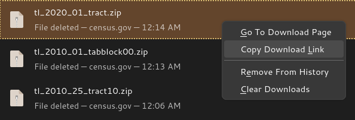
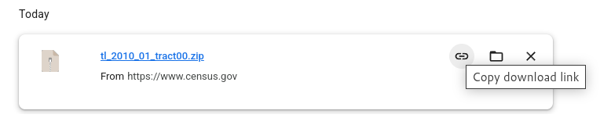

# Locating data on live websites

Note: some sections on this page are under construction (sections are complete unless otherwise noted).

Except for sites that host large quantities of files, it may not always be easy to compile a list of what to download. On sites like these, download tools and scripts may not be able to discover all of the URLs that you want to collect and require some assistance.

## File path reverse engineering

In many cases, files served by websites are named in a systematic way. By collecting a few URLs pointing to files from the same website / collection, we might be able to discover a pattern that can be used to build a list of URLS to download and use that list to retrieve the data in a programmatic way.

The most straightforward way to discover patterns like these is to paste the links into a text document, ensure that a [fixed width/monospace font](https://en.wikipedia.org/wiki/Monospaced_font) is used, and inspect the links visually. In most cases, the pattern (if any) should become quickly apparent. Otherwise, advanced diff tools and libraries like Python's [difflib](https://docs.python.org/3/library/difflib.html) may be useful.

### Collecting URLs

Most of the time, you can just copy and paste URLs straight from a web page into a text document. However, sometimes, these URLs are hidden behind portals or other interactive websites. In these cases, first download a few files, then copy the URLs from your browser's download history.

See below for some examples of what this might look like:

### Examples

The [U.S. Census Bureau TIGER/Line files](https://www.census.gov/cgi-bin/geo/shapefiles/index.php) are named as follows: `tl_[YEAR]_[FIPS]_[LEVEL].zip`, for example:

    https://www2.census.gov/geo/tiger/TIGER2010/TABBLOCK/2000/tl_2010_01_tabblock00.zip
    https://www2.census.gov/geo/tiger/TIGER2010/TABBLOCK/2000/tl_2010_02_tabblock00.zip
    https://www2.census.gov/geo/tiger/TIGER2010/TRACT/2010/tl_2010_01_tract10.zip
    https://www2.census.gov/geo/tiger/TIGER2010/TRACT/2010/tl_2010_02_tract10.zip
    https://www2.census.gov/geo/tiger/TIGER2020/TRACT/tl_2020_01_tract.zip
    https://www2.census.gov/geo/tiger/TIGER2020/TRACT/tl_2020_01_tract.zip
    
The [CDC BRFSS Annual Data](https://www.cdc.gov/brfss/annual_data/annual_data.htm) URLs take the following form: `https://www.cdc.gov/brfss/annual_data/[YEAR]/files/LLCP[YEAR]ASC.zip`, for example:

    https://www.cdc.gov/brfss/annual_data/2023/files/LLCP2023ASC.zip
    https://www.cdc.gov/brfss/annual_data/2016/files/LLCP2016ASC.zip

[Vegetation indices from NASA](https://lpdaac.usgs.gov/products/mod13a3v061/) URLs take the following form: `https://e4ftl01.cr.usgs.gov/MOLT/MOD13A3.061/[YEAR].[MONTH].[DAY}/MOD13A3.A[YEAR][DAY OF YEAR].h[GRANULE H COMPONENT]v[GRANULE V COMPONENT].061.2020048131446.hdf`, for example:

    https://e4ftl01.cr.usgs.gov/MOLT/MOD13A3.061/2000.02.01/MOD13A3.A2000032.h00v08.061.2020048131443.hdf
    https://e4ftl01.cr.usgs.gov/MOLT/MOD13A3.061/2000.02.01/MOD13A3.A2000032.h18v07.061.2020048131446.hdf
    https://e4ftl01.cr.usgs.gov/MOLT/MOD13A3.061/2000.03.01/MOD13A3.A2000061.h18v00.061.2020041171328.hdf

## Using APIs

Note: this section is under construction.

## Inspecting network requests

Note: this section is under construction.

Sometimes, data may be presented via a web interface such as an interactive map, table, or other visualization tool that retrieves data interactively (for example, as you navigate) but does not present any download links. These are often driven by public-facing APIs that can be exposed and probed using your browser's network inspector. However, unlike publicly-documented APIs, these APIs may only be documented internally and may require some reverse engineering to understand how they work.

Screenshots and instructions of how to open and use the network inspectors of different browsers will go here.

As with file path reverse engineering, the best way to reverse engineer an API is to:

1. Try out different features of whatever interactive tool is using the API,
2. Collect the URLs of HTTP requests that get sent as a result of your actions,
3. Paste both the URLs and details of the actions that triggered their requests into a word document, perhaps sorted by action (as with file path reverse engineering, ensure that a [fixed width/monospace font](https://en.wikipedia.org/wiki/Monospaced_font) is used), and
4. Scan the document for any patterns that emerge.

## Files meant for web crawlers

Note: this section is under construction.

Most high-traffic websites make use of standards such as [Sitemaps](https://en.wikipedia.org/wiki/Sitemaps) and [robots.txt](https://en.wikipedia.org/wiki/Robots.txt) that instruct automated web crawlers how to interface with the site in an efficient way. These files can be accessed by appending `sitemap.xml` or `robots.txt`, respectively, to the root of the website URL. For example:

- <https://www.nih.gov/>: <https://www.nih.gov/sitemap.xml> and <https://www.nih.gov/robots.txt>
- <https://www.cdc.gov/>: <https://www.cdc.gov/robots.txt> and <https://www.cdc.gov/wcms-auto-sitemap-index.xml> (discovered via the `robots.txt`)

By inspecting these files, we can learn more about what pages are available.
