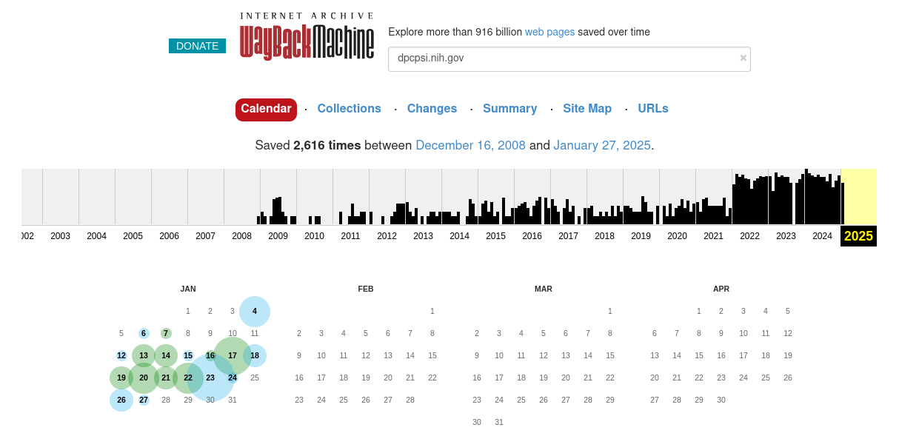
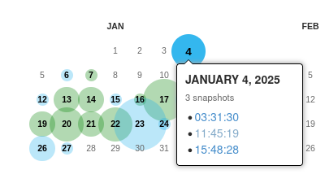
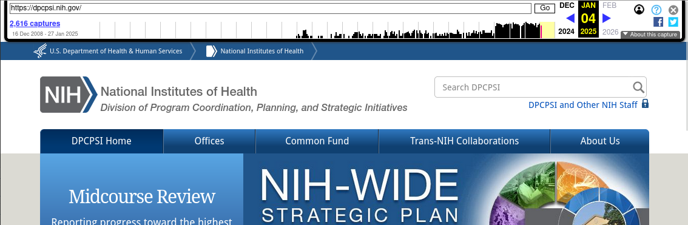
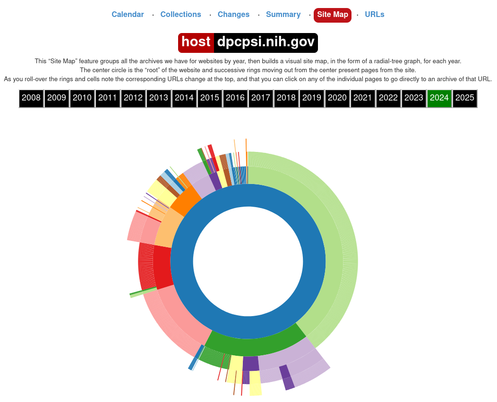
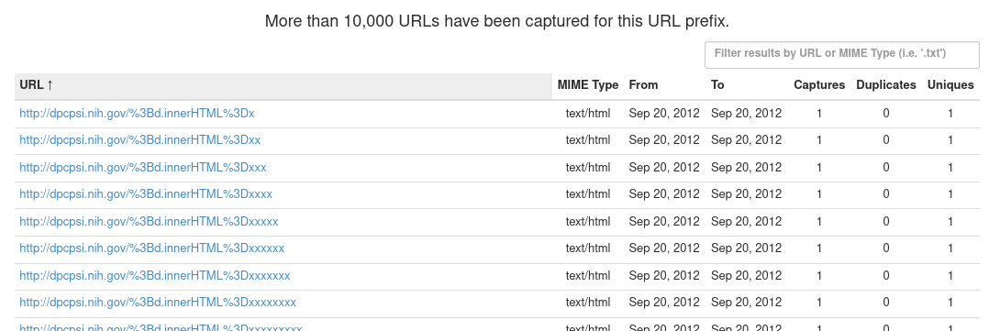

# Downloading from the Internet Archive

## Using the Wayback Machine web interface

The Wayback Machine web interface can be accessed by navigating to <https://archive.org>. More comprehensive information about the Wayback Machine is available on the [Internet Archive website](https://help.archive.org/help/category/the-wayback-machine/).

### The search bar

To search for content, use enter text into this search bar and press "Enter":


The text can either be:

1. A complete URL pointing to a page that you want to view captures of, or
2. A url prefix, i.e. the beginning of the URL up to the point that you typed. The prefix itself must be a valid path on its own (i.e. end with a `/`).

After submitting your query, you will be presented with a page similar to the one shown below.



The most relevant parts of this page are the different tab links (starting with "Calendar"), the capture graph, and the capture calendar.

### The Calendar tab

By default, if you entered the URL of a page, you will be presented with the Calendar tab which will show the year of the most recent capture. Use the graph at the top to change the year. The graph is a histogram showing the relative frequency of captures per month.

To view a capture, mouse over one of the days bubbled in green or blue. A window will pop up listing the times of captures made on that day:



Clicking on one of these will bring you to that capture.

### Capture pages

Capture pages will show how the page looked at the time of the capture. You can navigate these pages as you would a normal webpage and links will be substituted with Wayback Machine captures where possible.

In addition, the Internet Archive adds a toolbar at the top of each page to aid in navigation:



You can navigate through different captures by:

1. Clicking the link at the top left listing the number of captures, which will take you back to the calendar page;
2. Clicking on one of the months in the graph, which will take you to the first capture in that month; or
3. Using the left and right blue arrows (if any) at the top right, which will take you to the closest capture either before or after the one currently being viewed.

### The Site Map tab

From the main results page, you can click on "Site Map" to view the site map graph, which illustrates the different paths that branch from the current search query:



You can click on any part of this graph to be brought to the most recent capture of that page.

### The URLs tab {#urls-tab}

The URLs tab shows all captured URLs that are nested within the current search query:



These results can be browsed and filtered using the pagination links at the bottom right of the page or the filter input box at the top right. Most importantly, results can be filtered by [MIME type](https://developer.mozilla.org/en-US/docs/Web/HTTP/MIME_types/Common_types), which allow you to locate files of specific file formats.

Some examples of common MIME types:

- PDF files: `application/pdf`
- ZIP archives: `application/zip` or `application/x-zip-compressed`
- CSV files: `text/csv`

Partial matches are also supported. For example:

- `image/` can be used to match any image file.
- `video/` can be used to match any video file.

## Using download scripts

### Querying pages

### Downloading pages

## Using the CDX API

The Wayback Machine CDX API allows access to the indices that the Wayback Machine uses internally to keep track of and query archived URLs. If, for whatever reason, none of the above methods are available (for example on a headless server without the ability to install software), the CDX API can be used in conjunction with commonly-found command-line utilities to locate files for download. The CDX API is also useful for writing custom download scripts and programs or for exploring archived URLs.

This guide will not comprehensively document the CDX API itself as the Internet Archive already maintains [extensive documentation](https://archive.org/developers/wayback-cdx-server.html) on their website.

### Querying the CDX API {#querying-cdx-api}

The CDX API endpoint lives at <http://web.archive.org/cdx/search/cdx>. The main parameters of interest are:

- `url` (string): The primary filter. Must be [precent-encoded](https://en.wikipedia.org/wiki/Percent-encoding).
- `matchType` (string): Describes how `url` is matched. The following values will be the most useful:
  - `exact`: Results must match `url` exactly (default if `matchType` is not provided);
  - `prefix`: Results must begin with `url`.

Other useful parameters:

- `from` and `to` (integer): Filters the results by date range. Must be given in the form `YYYYMMDDhhmmss`; partial information is allowed (for example `YYYY` or `YYYYMMDD`).
- `limit` (integer): Limits the number of results returned. The CDX API docs note that _"the CDX server may return millions or billions of record[s]"_, so this may be necessary for larger or older sites.
- `fl` (one or more strings, comma-separated): Chooses which fields are returned, and in what order. The most useful fields are:
  - `timestamp`: The timestamp of the capture, formatted as `YYYMMDDhhmmss`.
  - `original`: The original URL. Not ideal for filtering due to things like port specification; see `urlkey` instead.
  - `mimetype`: The [MIME type](https://developer.mozilla.org/en-US/docs/Web/HTTP/MIME_types/Common_types) string.
  - `urlkey` and `"digest"`: The standardized URL and a checksum of the content, respectively. Useful for filtering out all duplicated URLs (`urlkey`) or only duplicated URLs with the same content (`digest`).
- `collapse` (string): Filters out results by the given field, returning only the first when ordered by date. See above for fields that can be passed to `collapse`.
- `filter` (string formatted like `[!]field:regex`): Use [regular expressions](https://en.wikipedia.org/wiki/Regular_expression) to filter based on field values.

Most common requests will take the form of `http://web.archive.org/cdx/search/cdx?url=[URL]&matchType=prefix`, which will return all URLs beginning with `[URL]`. Outputs are sorted by URL and date.

### Reconstructing the Wayback Machine URL from CDX API output

Using only the `timestamp` and `original` fields, we can reconstruct archived URLs of the results returned by the CDX API as using the following template:

`https://web.archive.org/web/[TIMESTAMP]/[ORIGINAL]`

where `[TIMESTAMP]` and `[ORIGINAL]` are the `timestamp` and `original` fields, respectively.

### Examples

Note: `&limit=5` has been appended to all example request URLs.

**Return all URLs beginning with `nih.gov`**

Request: <http://web.archive.org/cdx/search/cdx?url=nih.gov&matchType=host>

Response:

    gov,nih)/ 19971210191959 http://www.nih.gov:80/ text/html 200 VQYSXO37KW53LD7HTFOTW5PN5VF74CSM 1977
    gov,nih)/ 19971210191959 http://www.nih.gov:80/ text/html 200 VQYSXO37KW53LD7HTFOTW5PN5VF74CSM 1977
    gov,nih)/ 19971210191959 http://www.nih.gov:80/ text/html 200 VQYSXO37KW53LD7HTFOTW5PN5VF74CSM 1977
    gov,nih)/ 19980204234008 http://www.nih.gov:80/ text/html 200 343MBBETTNE43WB6TJSCIIGQSPVRG6AY 1992
    gov,nih)/ 19981212031409 http://www.nih.gov:80/ text/html 200 WA4UOXZMXJYHIIYABQCZB7MXJBURXNR6 2635
    
**Return all URLs beginning with `nih.gov` _with unique content_**

Request: <http://web.archive.org/cdx/search/cdx?url=nih.gov&matchType=host&collapse=digest>

Response:

    gov,nih)/ 19971210191959 http://www.nih.gov:80/ text/html 200 VQYSXO37KW53LD7HTFOTW5PN5VF74CSM 1977
    gov,nih)/ 19980204234008 http://www.nih.gov:80/ text/html 200 343MBBETTNE43WB6TJSCIIGQSPVRG6AY 1992
    gov,nih)/ 19981212031409 http://www.nih.gov:80/ text/html 200 WA4UOXZMXJYHIIYABQCZB7MXJBURXNR6 2635
    gov,nih)/ 19990117023817 http://nih.gov:80/ text/html 200 4LFPLNNQ67M6LJT3LZBBNT3RNZKUJLXS 2604
    gov,nih)/ 19990125091117 http://nih.gov:80/ text/html 200 VY6HRTZDJND4JKWNMAVH43OBEV5HKR5B 2744

Note that 3 records with duplicate content have been dropped between the previous request and this one.

**Return all _unique URLs_ beginning with `nih.gov`**

Request: <http://web.archive.org/cdx/search/cdx?url=nih.gov&matchType=host&collapse=urlkey&limit=5>

Response:

    gov,nih)/ 19971210191959 http://www.nih.gov:80/ text/html 200 VQYSXO37KW53LD7HTFOTW5PN5VF74CSM 1977
    gov,nih)/!%0d%0a%20medlinep 20210505215349 http://nih.gov/!%0D%0A%20medlinep text/html 301 PAJQC5WJFC6FWJIM7WZA7WU2SW5AU43R 440
    gov,nih)/!clearcommunication/plainlanguage/index.htm 20240816204904 https://www.nih.gov/!clearcommunication/plainlanguage/index.htm text/html 404 WLBW2ZNS7QAI6LLO3D6CLUYLU5SKQEXJ 8042
    gov,nih)/!clearcommunication/plainlanguage/index.htm!figure 20240816203157 http://www.nih.gov/!clearcommunication/plainlanguage/index.htm!Figure unk 301 3I42H3S6NNFQ2MSVX7XZKYAYSCX5QBYJ 259
    gov,nih)/" 20000201081541 http://www.nih.gov:80/%22 text/html 404 UDSH36NBYWO2X73LNMX2LEHLNQ7FYXHZ 326

Note that this query will only return the first capture in each collapse group. To get the most recent capture for each group, it would be better to collapse by `digest` instead and then process the output.

**Return all unique _PDF files_ (MIME type: `application/pdf`) beginning with `nih.gov`**

Request: <http://web.archive.org/cdx/search/cdx?url=nih.gov&matchType=host&collapse=urlkey&filter=mimetype:application/pdf>

Response:

    gov,nih)/about/97_almanac/almanac97.pdf 20041031172700 http://www.nih.gov/about/97_Almanac/almanac97.pdf application/pdf 200 B6XAXDQ5YA2BD2FC7CWH6HLG7YAGRQT5 1412860
    gov,nih)/about/almanac/2001/appropriations/appropriations2001.pdf 20041107184849 http://www.nih.gov/about/almanac/2001/appropriations/appropriations2001.pdf application/pdf 200 YQNM4XRHFNFUC3RPAERP7T6F7OWS6TDQ 49644
    gov,nih)/about/almanac/almanac_2006_2007.pdf 20070824135850 http://www.nih.gov/about/almanac/Almanac_2006_2007.pdf application/pdf 200 Q33VZSPQ7EUOVJ7PLGGFGLYRS4466FGV 2005821
    gov,nih)/about/almanac/almanac_2008_2009.pdf 20081029135142 http://www.nih.gov/about/almanac/Almanac_2008_2009.pdf application/pdf 200 CNYNO3S7OWTPSYCJKIT2LCJTMDKZJ3WI 2610665
    gov,nih)/about/almanac/archive/2001/appropriations/appropriations2001.pdf 20080924150457 http://www.nih.gov/about/almanac/archive/2001/appropriations/appropriations2001.pdf application/pdf 200 YQNM4XRHFNFUC3RPAERP7T6F7OWS6TDQ 49675

**The same as the previous example, but _dump the URLs only_** (for example to feed into a download tool)

Request: <http://web.archive.org/cdx/search/cdx?url=dpcpsi.nih.gov&matchType=host&collapse=digest&filter=mimetype:application/pdf&fl=original>

Response:

    http://dpcpsi.nih.gov/collaboration/2007_Report_of_Trans-NIH_Research.pdf
    http://dpcpsi.nih.gov/collaboration/2008_Report_of_Trans-NIH_Research.pdf
    http://dpcpsi.nih.gov/collaboration/2009_Report_of_Trans-NIH_Research.pdf
    http://dpcpsi.nih.gov/collaboration/Trans-NIH_Research.pdf
    http://dpcpsi.nih.gov/council/110807minutes.pdf

Note that the above URLs cannot be passed to raw downloaders like `wget`, `aria2`, etc. directly if the content is no longer live and are only usable by downloaders like `wayback_machine_downloader` and `waybackpack` that are specific to the Internet Archive. See below for an example of how to reconstruct `archive.org` URLs that can be passed to those tools.

**The same as the previous example, but reconstruct the `archive.org` URLs using Bash** (for example to feed into a download tool)

```bash 
curl "http://web.archive.org/cdx/search/cdx?url=dpcpsi.nih.gov&matchType=host&collapse=digest&filter=mimetype:application/pdf&fl=original" |
    while IFS=" " read urlkey timestamp original mimetype statuscode digest length
    do
        echo "https://web.archive.org/web/${timestamp}/${original}"
    done # From here, redirect to a file or pipe to a download tool
```

## Common pitfalls

### Rate limits

The Internet Archive will temporarily block IP addresses that make too many requests in a short amount of time. It's not clear exactly what the rate limit is for different endpoints, but a [15 capture requests per minute](https://archive.org/details/toomanyrequests_20191110) limit is imposed for the Wayback Machine with a penalty of being blocked for 5 minutes for violating.

Care should be taken to:

- Use tools with built-in rate limiting features,
- Write rate limiting features or the ability to handle [HTTP 429 Too Many Requests](https://developer.mozilla.org/en-US/docs/Web/HTTP/Status/429) errors into your custom scripts and programs,
- Limit the number of concurrent requests, and
- Ensure that only one or a few people are accessing `archive.org` at a time if there are multiple people doing retrieval work from the same network.

### Non-nested websites and externally-linked resources

Many of the common download tools and interfaces for interacting with the Internet Archive (including the CDX API) do not play well with sites whose content is not strictly nested. By this, we mean sites that utilise webpages that pull resources from:

- Other paths / domains of the same site, or
- Other sites entirely, such as content delivery networks.

For example, the homepage of the NIH Sexual & Gender Minority Research office, which used to live at <https://dpcpsi.nih.gov/sgmro>, linked resources from:

- <https://dpcpsi.nih.gov/sites> (embedded images),
- <https://dpcpsi.nih.gov/themes> (stylesheets), and
- <https://dpcpsi.nih.gov/core> (scripts),

all of which are located on different directory trees and so would not show up in queries of `dpcpsi.nih.gov/sgmro`. 

This issue is more prevalent on sites that make use of content management systems like Drupal or WordPress and sites that use website building and hosting services such as those offered by Wix.com and Squarespace.

The most straightforward way to work around this issue is to:

1. Query all HTML files from the site of interest, which should hopefully be nested;
2. Download all of the returned URLs; and
3. Parse the the downloaded HTML files to identify tags of interest and the URLs that they link to.

For example, the following `bash` + `htmlq` code will dump the URLs of images referenced by HTML files in the current directory:

```bash
find . -name '*.htm*' -print0 |
    xargs -0 cat |
    htmlq img -a src
```

## Worked examples