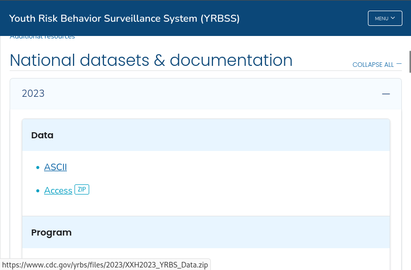
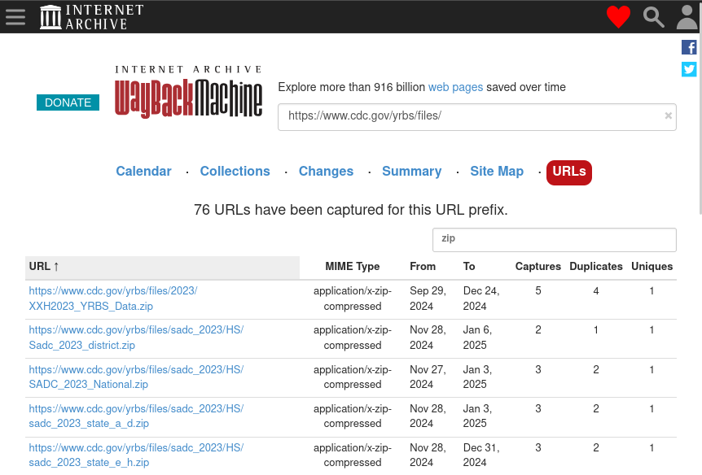

# Triage

Not all websites and data files are of equal risk of being unrecoverable. Thanks to the [Internet Archive](https://archive.org/) and the work of groups like [ArchiveTeam](https://wiki.archiveteam.org/), many copies of at-risk sites and data have already been made. In time-sensitive situations, care should be taken to prioritize data that is less likely to be backed up and retrievable at a later date.

## Low concern: statically-linked files

Of least concern are files that are statically-linked, i.e. files that are shown at the bottom left of your browser window when you hover your mouse over them. For example, see the following screenshot of a page that lists data downloads from the CDC Youth Risk Behavior Surveillance System:

When we mouse over the "Access [ZIP]" link, we can see a small popup at the bottom left of the window displaying a URL, which indicates that this file is statically-linked:

**Statically-linked files such these are the most likely to be picked up by web crawlers**, such as those run by the Internet Archive. We can confirm whether or not these data have already been archived by consulting the Wayback Machine before proceeding (see the [Wayback Machine URLs Tab](#urls-tab) or the [querying the CDX API](#querying-cdx-api) sections):

**If time is extremely limited, then assume that pages and files that are statically-linked have already been captured and move on.**

## Medium concern: links from dynamic webpages

Many webpages do not serve static content but rather dynamically generate the page using JavaScript. Many social media pages operate like this to slowly feed users a stream of content rather than loading a lot of content all at once.

These pages can be identified through the following methods:

1. Do pieces of the page move around or appear / disappear as you navigate?
2. Does the page loading indicator appear and disappear as you navigate?
3. Install a JavaScript blocker such as [NoScript](https://noscript.net/) and navigate to the page. Is it now broken?

**Because these pages require user intervention for certain parts to load**, they may not be picked up by basic web crawlers. However, these pages _can be captured using browser automation tools like [Selenium](https://www.selenium.dev/)_ or hide navigable tags and URLs in their source code (for example, using CSS), so there is a chance that they _may_ be picked up by more sophisticated web crawlers.

## High concern: data behind portals

Data that exist behind **portals requiring user interaction via the mouse or keyboard** are of high concern, since basic web crawlers may not be able to interface with the portal depending on how it is set up. Unlike dynamically-loading pages, it's more likely that these portals behave in drastically different ways. Of special concern are portals that use JavaScript to operate, though these are hard to identify without looking into the source HTML code behind a page.

Portals can be identified by their distinctive buttons and menus that do not display URLs at the bottom left of your browser window when your mouse hovers over them. Most of the time, these are HTTP `<input>` tags. See the [MDN page on HTML `<input>` types](https://developer.mozilla.org/en-US/docs/Web/HTML/Element/input#input_types) for more examples of how these look in your browser.

See below for some examples of portals with their distinguishing features highlighted:

 data portal.](images/5-cdc-wonder-annotated.png)

. TIGER/Line is a special case because the data that it offers is available either through the form or through an FTP link co-located next to the form, which _can_ easily be crawled by bots.](images/5-tiger-line-annotated.png)

## Highest concern: data served only by APIs

In some cases, data behind portal _can_ be crawled if there is not heavy use of JavaScript or if the data is accessible through static links (for example the TIGER/Line data). However, data behind [APIs](https://en.wikipedia.org/wiki/API) _most likely cannot be crawled_, as **there is no single standard for designing an API**. Many different API protocols exist for data of different purposes, for example [OpenAPI/Swagger](https://www.openapis.org/), [CKAN](https://ckan.org/), [GraphQL](https://graphql.org/), etc.

As such, knowledge of

1. What API protocol is being used (if the API is even using a standardized protocol to begin with),
2. Which endpoints are responsible for serving the data of interest, and
3. How to write a program to interface with those endpoints API and scrape data

are all required in order to scrape data from an API, and all of these generally require human intervention.

As with the previous sections, **some data that are accessible from APIs can also be retrieved through other means**. When determining what data is most vulnerable, be sure to check if this is true for any given API before assigning it a high priority.

## Summary

- When deciding what pages and data to prioritize for preservation, think: **is a robot able to retrieve this data on its own, without human intervention**? If so, then it's likely that one already has and that you will be able to retrieve that data later.
- To reiterate: **if time is extremely limited, then assume that pages and files that are statically-linked have already been captured and move on.**
